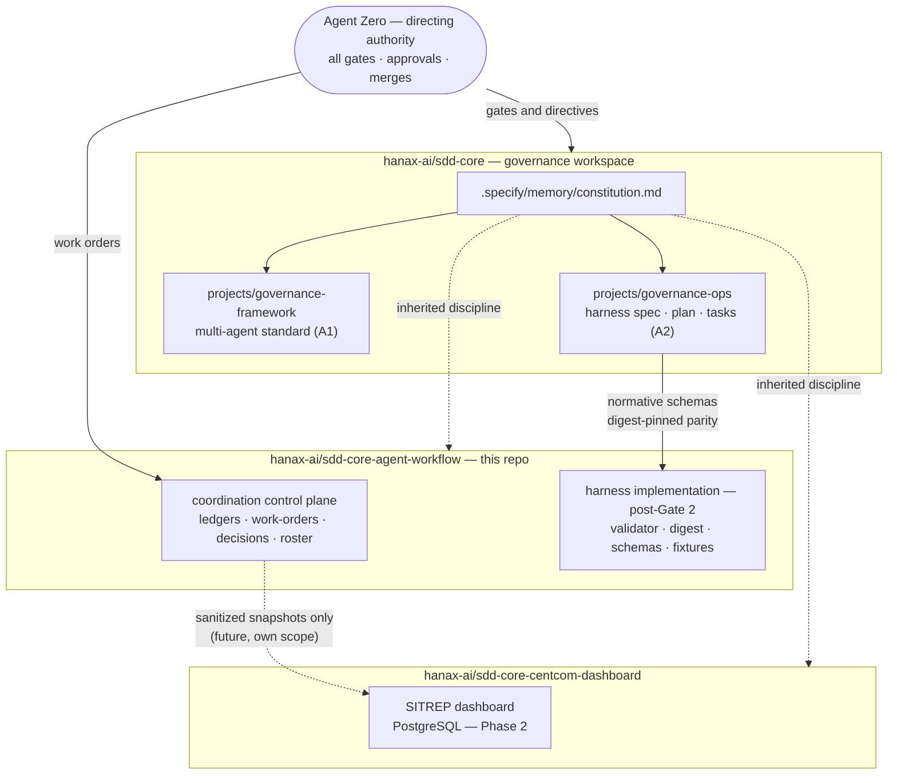
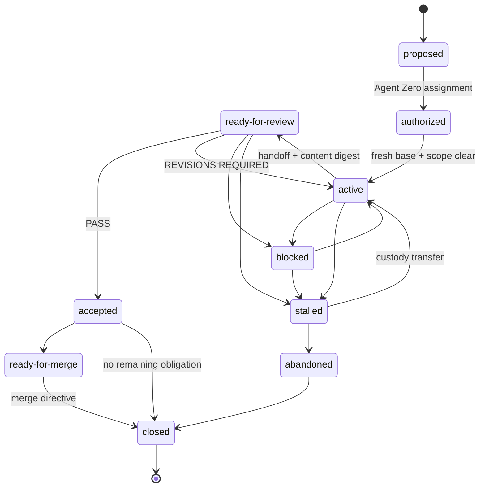

# sdd-core-agent-workflow

[](https://github.com/hanax-ai/sdd-core-agent-workflow/actions/workflows/ci.yml)

Coordination control plane and future implementation home for the SDD-Core
three-agent workflow harness. Part of the Hana-X SDD-Core program alongside
[`sdd-core`](https://github.com/hanax-ai/sdd-core) (governance workspace) and
[`sdd-core-centcom-dashboard`](https://github.com/hanax-ai/sdd-core-centcom-dashboard)
(SITREP dashboard).

**Status:** Non-authoritative scaffolding. The governing master charter
(`SDD-3A-MASTER`, candidate v0.2.1) is PROPOSED and unaccepted. Nothing in
this repository grants or implies Gate 1, Gate 2, publication, or merge
authority. Published under Agent Zero publication authorization, 2026-07-23.

## Program architecture



Governance artifacts (specs, plans, normative schemas) live in `sdd-core`;
executable harness code lands here only after Gate 2; the dashboard reports. No repository
grants authority to another — every arrow from Agent Zero is an explicit,
recorded decision.

## Purpose

1. **Interim coordination control plane** (SDD-3A-MASTER §7, operative only
   once the master is accepted): append-only ledgers, work-order records,
   decision records, and the agent roster. **Live record content is
   machine-local and git-ignored** — this public repository carries only
   policy files, READMEs, and synthetic templates.
2. **Future home of harness implementation code** — validator, digest
   tooling, executable schema copies, fixtures, and tests — only after the
   governing specification and plan are accepted in
   `sdd-core/projects/governance-ops/` and an explicit Agent Zero Gate 2
   directive names them.

## Authorization pipeline

Two gates stand between an idea and running code. Neither is ever implied —
each is an exact, recorded Agent Zero directive, and artifact identity is
bound to SHA-256 content digests before review.

```mermaid
flowchart LR
    WIP["WIP item<br/>(non-authoritative)"]
    SPEC["spec.md"]
    PLAN["plan.md → tasks.md"]
    PUB["publication<br/>draft PR + publication_digest"]
    CODE["implementation<br/>(this repo, src/)"]
    MAIN["main"]

    WIP -->|"Gate 1:<br/>Approved for promotion"| SPEC
    SPEC -->|planning authorization| PLAN
    PLAN -->|"planning acceptance<br/>(content_digest-bound)"| PUB
    PUB -->|"Gate 2:<br/>Approved for implementation"| CODE
    CODE -->|"independent review +<br/>separate merge approval"| MAIN
```



## Work-order lifecycle

Every assignment runs as a bounded work order with an append-only ledger
(SDD-3A-MASTER §7.4). `done` never means reviewed, accepted, approved,
merged, or closed.



## Layout

```
sdd-core-agent-workflow/
├── README.md                    this file
├── AGENTS.md                    harness adapter — BENEATH sdd-core governance
├── roster.md                    agent identities ↔ charter roles
├── LICENSE                      Apache-2.0
├── SECURITY.md                  repo-specific threat model
├── CONTRIBUTING.md              governance-routed contribution rules
├── CHANGELOG.md                 date-headed, Keep-a-Changelog style
├── verify-layout.sh             structural verifier (run by CI)
├── ledgers/                     append-only ledgers (live content machine-local)
├── work-orders/                 work-order records (live content machine-local)
├── decisions/                   decision queue + events (live content machine-local)
└── .github/
    ├── workflows/ci.yml         `required` (Linux) + `windows-advisory`
    ├── dependabot.yml           github-actions, monthly, grouped
    ├── branch-protection-ruleset.md
    ├── PULL_REQUEST_TEMPLATE.md
    └── ISSUE_TEMPLATE/          defect-report, idea
```

Planned after Gate 2 (not present by design): `src/` (schemas, validator,
digest tooling, derived read-model index), `fixtures/`, and the canonical
`npm run verify` chain (zero runtime dependencies; dev dependencies grouped
under monthly Dependabot).

## Governance

Authority order (see `AGENTS.md`): sdd-core root constitution → root mirror
registry → project constitutions → approved feature artifacts → accepted
SDD-3A-MASTER charter → assigned work orders → this repository's files.

- No implementation before an explicit Agent Zero Gate 2 directive.
- Merge, review, and CI results are never approval.
- Structural changes update `verify-layout.sh` REQUIRED_PATHS and the
  layout tree above in the same commit.

## Verification

```bash
bash verify-layout.sh
```

CI runs the same script on Linux (`required`, merge-gating) and Windows
(`windows-advisory`).
